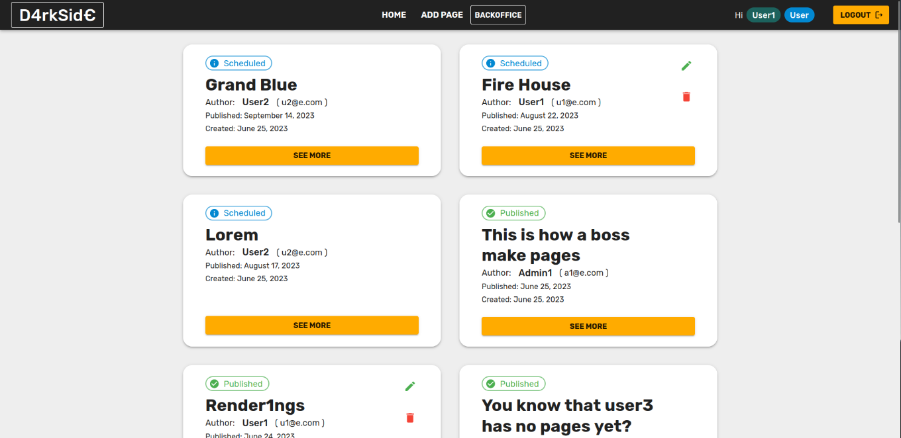
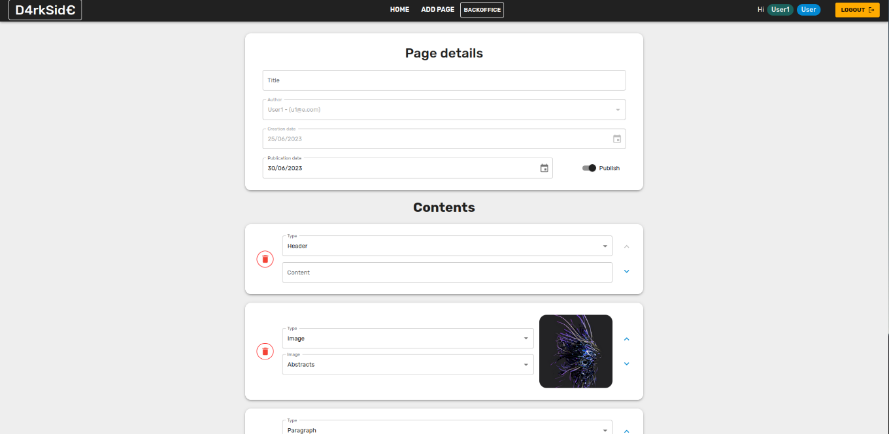

# Server side

## API Server

- POST `/session`
  - request: username, password
  - response: user (id,role,name,email)
- GET `/session/current`
  - request: NONE (except session cookie)
  - response user (id,role,name,email)
- DELETE `/logout`
  - request: NONE (except session cookie)
  - response: {message:string}
- GET `/pages/:pageSlug`
  - request: pageSlug (param)
  - response: page (id,title,author,publication_date,creation_date,contents)
- GET `/pages`
  - request: NONE (except session cookie if any)
  - response: array of pages
- GET `/users`
  - request: NONE (except session cookie) -> admin only
  - response: array of users (email,name)
- POST `/pages`
  - request: page (author,title,author,publicationDate,contents) -> logged only
  - response: data: { id, slug } or { error }
- DELETE `/pages/:id` 
  - request: id(param) (and session cookie) <- logged only
  - response: {error} or {message}
- PUT `/site`
  - request: (name) <- admin only
  - response: {name} or {error}
## Database Tables

- Table `USERS` - (id,name,email,password,salt,role)
- Table `PAGES` - (id,title,author,creation_date,publication_date,slug)
- Table `CONTENTS` - (page,type,data,sequence)
- Table `SITE_DETAILS`- (name,val)

# Client side


## React Client Application Routes

- Route `/`: page list (home)
- Route `/add-page`: page for creating pages
- Route `/pages/:pageSlug`: page for viewing the page in detail
- Route `/pages/:pageSlug`: page for viewing the page in detail
- Route `/edit/pages/:pageSlug`: page for editing a page
- Route `/site-name`: page for editing the site name
- Route `/login`: login page
- Route `/*`: Not found page


## Main React Components

- `AddPage` (in `/pages/AddPage/index.jsx`): page component add new page
- `EditSiteName` (in `/pages/EditSiteName/index.jsx`): page component for editing the site name
- `Login` (in `/pages/Login/index.jsx`): page component for login
- `NotFound` (in `/pages/NotFound/index.jsx`): page component for not found page
- `PagesList` (in `/pages/PageList/index.jsx`): page component for home page (`/`)
- `PageView` (in `/pages/PageList/index.jsx`): page component display a page content

(only _main_ components, minor ones may be skipped)

# Usage info

## Example Screenshot




## Users Credentials
```js
{
    email: "a1@e.com",
    name: "Admin1",
    password: "psw",
    role: "admin",
},
{
  email: "a2@e.com",
  name: "Admin2",
  password: "psw",
  role: "admin",
},
{
  email: "u1@e.com",
  name: "User1",
  password: "psw",
  role: "user",
},
{
  email: "u2@e.com",
  name: "User2",
  password: "psw",
  role: "user",
},
{
  email: "u3@e.com",
  name: "User3",
  password: "psw",
  role: "user",
}
```
